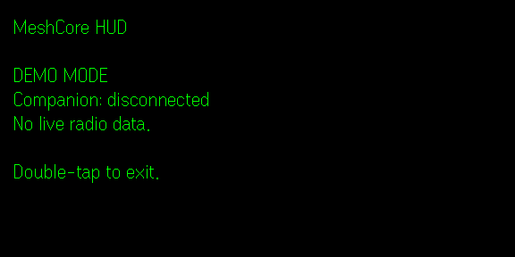

<div align="center">

# MeshCore HUD

**A small window into your mesh.**

A lightweight [MeshCore](https://meshcore.co.uk/) HUD for Even Realities G2 smart glasses.

[](https://github.com/haydenkz/meshcore-g2/actions/workflows/ci.yml)
[](https://github.com/haydenkz/meshcore-g2/blob/main/tsconfig.json)
[](https://hub.evenrealities.com/docs)

[Get started](#-get-started) · [Development guide](docs/development.md) · [Connection research](docs/architecture.md) · [Changelog](CHANGELOG.md)

</div>

---

### ◉ Status

**First milestone: scaffold and package delivery.** The SDK-backed HUD shows
“MeshCore HUD”, **DEMO MODE**, and **Companion: disconnected**. Double-tap exits.
The official simulator provides development without glasses or a radio.

<div align="center">
  
</div>

**Planned:** real companion connectivity, battery information, incoming messages,
and supported radio details. None of these live features is implemented yet.
Bluetooth access from the Even App remains unverified; see the
[connection options and limitations](docs/architecture.md#connection-options).

### ↗ Get started

Use Node **24.19.0 LTS** and npm. With [nvm](https://github.com/nvm-sh/nvm) installed:

```sh
nvm install
nvm use
npm ci
npm run dev
```

In another terminal, run `npm run simulate`. A normal browser shows the phone
page; the simulator provides the SDK bridge and glasses display.

For real G2 testing, use Even App **2.2.10+**, keep phone and computer on the same
network, and run `npm run qr -- --url http://YOUR_LAN_IP:5173`. Scan from the Even
App. [Device checklist and simulator details →](docs/development.md)

### ⌘ Development

```sh
npm run check   # Format, lint, strict types, behavior tests, build
npm run pack    # Build and create meshcore-hud.ehpk
```

Work on a branch, make focused commits, update `CHANGELOG.md`, and open a PR
against `main`. Leave merging to review. See [AGENTS.md](AGENTS.md) for commands.

CI checks every PR and push to `main`. Successful PR, `main`, and manual runs
produce a downloadable `.ehpk` under the
[workflow run’s **Artifacts**](https://github.com/haydenkz/meshcore-g2/actions/workflows/ci.yml).
Even Hub publication is a later milestone.

The app keeps a small MeshCore data-source interface separate from HUD rendering.
Read the [architecture](docs/architecture.md) and
[validation record](docs/validation.md) for verified behavior and hardware gaps.

<div align="center">

Built from the [official minimal starter](https://github.com/even-realities/evenhub-templates/tree/main/minimal).
Independent community project; not affiliated with MeshCore or Even Realities.

</div>
