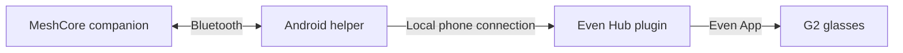

# MeshCore G2

Your MeshCore radio's connection status and battery, on Even Realities G2 glasses.

**Two apps, one phone.** Install the Android helper and the Even Hub plugin, then
link them once. No computer, cloud relay, or internet connection is needed to use
the installed pair with your radio.

| Application                     | Installed in                   | What it does                                           |
| ------------------------------- | ------------------------------ | ------------------------------------------------------ |
| **MeshCore G2 Helper** (`.apk`) | Your Android phone             | Connects to the MeshCore companion over Bluetooth.     |
| **MeshCore G2** (`.ehpk`)       | The Even App on the same phone | Reads the helper and displays radio status on your G2. |

**Early access.** The initial connection works on real hardware. Pairing, radio
identity, connection status, and battery voltage are implemented. Sending and
receiving messages are not implemented. Battery is read when the radio connects;
it is voltage, not a battery percentage. iOS is not supported.

## Install

You need an Android phone running **Android 8 or newer**, a MeshCore radio running
companion BLE firmware, G2 glasses paired with the **Even App 2.2.10 or newer**, and
Bluetooth enabled. The tested phone is a Pixel 10 Pro XL running Android 17.
Other supported Android versions still need hardware coverage.

### 1. Get a matching pair

Use the same version of both apps from
[GitHub Releases](https://github.com/haydenkz/meshcore-g2/releases).
Each release contains an Android APK, an Even package, installation instructions,
and SHA-256 checksums. Download the APK asset, not GitHub's **Source code** archive.

**There is no public Even Hub listing yet.** For early access, the maintainer must
add your Even account to a beta group and assign the matching Even build. Check
availability with the maintainer before installing. Downloading an `.ehpk` alone
does not install it in Even.

If no release has been published yet, developer test builds are available from
successful [CI runs](https://github.com/haydenkz/meshcore-g2/actions/workflows/ci.yml)
under **Artifacts → meshcore-g2-preview-…** (GitHub sign-in required). Extract the
archive. The APK ending in `-dev.apk` installs **MeshCore G2 Helper (Dev)** and
requires the same Even beta/developer access. Test APKs can require uninstalling
the previous Dev build between runs because their debug signing keys differ.

### 2. Install the Android helper

On your phone, open `meshcore-g2-android-VERSION.apk` and follow Android's installer.
If prompted, allow installs from the browser or file manager you used to open it.

Open **MeshCore G2 Helper**, grant **Nearby devices**, and allow its notification
so you can see when it is running. On Android 11 and earlier, scanning also needs
Location permission and Location enabled.

### 3. Install the Even plugin

After the maintainer has invited your Even account and assigned the build, open
the Even App → **Me → Beta tester**, find **MeshCore G2**, and tap **Install**.
Use the same account that received access. See
[Even's beta installation instructions](https://hub.evenrealities.com/docs/test/beta-testing).

Developers installing in their own Even project can use the
[private-build steps in the contributor guide](https://github.com/haydenkz/meshcore-g2/blob/main/CONTRIBUTING.md#test-on-hardware).
The `.ehpk` asset is for the Even developer portal; Android's APK installer cannot
open it. Portal upload and beta distribution are manual steps.

### 4. Connect and link once

1. Disconnect other MeshCore apps from your radio. In the helper, tap **Find radio**,
   select your companion, and complete Android's pairing prompt if shown.
2. Wait for **Connected**, your radio's name, and a battery voltage in the helper.
3. Tap **Copy connection key**. Open **MeshCore G2** in the Even App, paste the key,
   and tap **Link phone helper**.
4. Confirm the same radio name and battery appear in Even and on your glasses.
   The plugin remembers this helper for later launches.

Keep the helper running while using the glasses. You can hide its screen; its
ongoing notification indicates that the service is active. Use **Stop helper**
when finished. Run only one helper at a time, including if both Dev and release
editions are installed. Reliable locked-phone operation is still being tested.

## Updating

Install the newer APK over the existing release helper, update the Even plugin to
the matching version, then reconnect the radio. A normal signed release update
preserves the helper key. Do not uninstall the release helper first unless you
intend to clear its saved link.

## Troubleshooting

| Problem                            | What to do                                                                                                                       |
| ---------------------------------- | -------------------------------------------------------------------------------------------------------------------------------- |
| Radio is missing from the scan     | Check its companion BLE firmware, Android permissions, and whether another MeshCore app is connected.                            |
| Helper connects, but Even does not | Update **both** apps. In Even, expand **Connection details → Check connection**; then check the helper's request diagnostics.    |
| Connection key is rejected         | In Even's **Connection details**, choose **Forget helper**, then copy and paste the helper's key again.                          |
| Even shows demo data               | Open **Connection details** and return from demo with **Reconnect**, or link the helper if this is first setup.                  |
| Beta build is missing              | Verify that your Even account was added to the beta group and that the maintainer assigned a build to it.                        |
| Android refuses an update          | Confirm whether this is a Dev APK, an early test install, or a signed release. Different signing keys cannot update one another. |

The helper's **Connection details → Copy diagnostics** includes versions, BLE
state, and counts of health/preflight/status requests. It excludes the connection
key. Include this report when
[reporting a problem](https://github.com/haydenkz/meshcore-g2/issues).

## Development

Both apps live in this repository: `apps/even` and `apps/android`.
[CONTRIBUTING.md](https://github.com/haydenkz/meshcore-g2/blob/main/CONTRIBUTING.md)
covers local setup, tests, the phone connection, and releases.
[CHANGELOG.md](https://github.com/haydenkz/meshcore-g2/blob/main/CHANGELOG.md)
records product changes.

Independent project; not affiliated with MeshCore or Even Realities. The Even app
adapts the official starter; its
[third-party notice](https://github.com/haydenkz/meshcore-g2/blob/main/apps/even/public/THIRD_PARTY_NOTICES.md)
is included in the packaged plugin.
