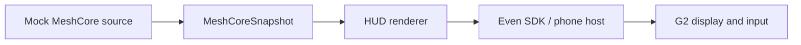

# Architecture and connection research

Reviewed against official sources on **2026-09-08**.

## Runtime and scaffold

Even Hub plugins are web apps inside the **Even App on the phone**: Chromium on
Android and WKWebView on iOS. The SDK talks to the native host, which handles the
Bluetooth connection to G2. The glasses display containers and return input;
application logic runs on the phone. Node is build/test tooling, not the deployed
runtime. [Official architecture](https://hub.evenrealities.com/docs/get-started/architecture).

This project adapts the
[official minimal template at `8cb0135`](https://github.com/even-realities/evenhub-templates/tree/8cb01354f5ee914c5fab97d06e6d13b28eeb5815/minimal)
and the [Everything EvenHub guidance](https://github.com/even-realities/everything-evenhub).
It retains Vite, strict TypeScript, the SDK startup page, CLI manifest, and official
simulator. Starter license attribution is in [THIRD_PARTY_NOTICES.md](../public/THIRD_PARTY_NOTICES.md).

The npm metadata and installed declarations were checked for SDK **0.0.15**, CLI
**0.1.14**, and simulator **0.9.5**. The SDK's published README sets minimum Even
App **2.2.10**. The manifest matches it. TypeScript **5.9.3** satisfies the CLI's
`^5` peer requirement; Vite **8.2.2** and the other build tools support Node
**24.19.0 LTS**, pinned in `.nvmrc`. See the
[SDK package](https://www.npmjs.com/package/@evenrealities/even_hub_sdk),
[CLI package](https://www.npmjs.com/package/@evenrealities/evenhub-cli), and
[Node release schedule](https://nodejs.org/en/about/previous-releases).

| File                          | Responsibility                                                |
| ----------------------------- | ------------------------------------------------------------- |
| `src/meshcore/source.ts`      | Small asynchronous snapshot interface; no transport coupling  |
| `src/meshcore/mock.ts`        | Demo/disconnected snapshot, without invented telemetry        |
| `src/hud.ts`                  | One 576 × 288 SDK text container and exit handling            |
| `src/main.ts`                 | Select mock, wait for bridge, start HUD, report status/errors |
| `index.html`, `src/style.css` | Lightweight phone host page                                   |

There is no backend, MeshCore dependency, transport implementation, or persistence
layer. Add telemetry fields when a real adapter needs them. Live updates can later
use `textContainerUpgrade` without rebuilding the entire page.

## Connection options

The [MeshCore companion protocol](https://docs.meshcore.io/companion_protocol/)
documents BLE GATT writes/notifications, initialization, device information,
queued messages, and battery **millivolts**. Voltage is not a universal percentage.
The protocol guide warns it is still in development; validate against the chosen
radio firmware and official libraries before implementing a parser.

| Approach                                   | Evidence and unresolved constraints                                                                                                                                                                                                                                                                                                                                 |
| ------------------------------------------ | ------------------------------------------------------------------------------------------------------------------------------------------------------------------------------------------------------------------------------------------------------------------------------------------------------------------------------------------------------------------- |
| Direct Web Bluetooth from the Even WebView | MeshCore's official JS library has a browser BLE adapter. This does **not** establish support in the Even App. The inspected Even SDK API and permission schema expose no general third-party BLE/GATT interface. API availability, user-gesture/device-selection flow, permissions, pairing, and background behavior require confirmation on each target phone OS. |
| Native phone integration                   | A native BLE helper could own the companion connection, but exposing it to an Even plugin requires a supported host extension or an explicitly designed relay. No such integration has been verified or built here.                                                                                                                                                 |
| External relay over HTTPS/WebSocket        | A later adapter could read from a service that owns BLE/USB/TCP access. Even documents browser networking, but the relay must meet manifest whitelisting, HTTPS, authentication, and HTTP CORS requirements (plus WebSocket origin handling). LAN reachability and mobile background behavior need testing. This is a candidate, not an included backend.           |
| USB or TCP/Wi-Fi directly in the plugin    | The official MeshCore JS library supports browser Web Serial and Node serial/TCP transports for appropriate companion firmware. Browser Web Serial support is unverified in the Even host; Node transports cannot run in the WebView. Raw TCP is not a WebSocket endpoint.                                                                                          |

Transport capabilities above are documented by
[MeshCore.js](https://github.com/meshcore-dev/meshcore.js). Even's available native
capabilities and network constraints are documented in
[Device APIs](https://hub.evenrealities.com/docs/build/device-apis) and
[Networking](https://hub.evenrealities.com/docs/build/networking).
Absence of a documented BLE bridge is a limitation of the inspected API, not proof
that no future platform integration is possible. A direct **glasses-to-companion**
connection is not part of the documented plugin architecture.

## Next practical step

Make a small, separate capability spike on the actual target phone and Even App
version: establish whether a supported third-party BLE path exists and whether
`navigator.bluetooth` is exposed in the plugin host. If it is, test selection,
GATT notifications, and a read-only device/battery query with a real companion.
Check background/resume and coexistence with the phone-to-G2 link. Confirm this
with Even's platform guidance before choosing a transport.

If direct access is unavailable, evaluate an authenticated HTTPS/WebSocket relay
using an official MeshCore library on a supported host. Then implement only that
confirmed transport behind `MeshCoreSource`, starting with connection status and
actual battery voltage. Message handling and richer radio information remain
later work.
